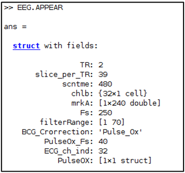
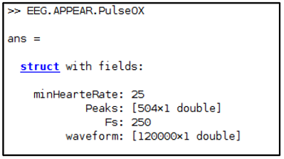

# APPEAR Toolbox
## _An Automatic Pipeline for EEG Artifact Reduction_

## _Codes and scripts are maintained by Obada Al Zoubi. If you have any questions, please reach out to me at my email: obada.y.alzoubi@gmail.com_ 

Removing artifacts from simultaneous EEG-fMRI recordings is a challenging issue since it requires manual
attending with specialized expertise. Additionally, manual correction is prone to experimenter biases in
cleaning data. Thus, we developed a fully automated pipeline for EEG artifacts reduction (APPEAR).
APPEAR was validated and compared to manual EEG preprocessing for two common applications - resting
and task-based EEG-fMRI acquisitions. APPEAR offers A-to-Z preprocessing for EEG and generates
ready-to-analyze output while cleaning MR, ballistocardiogram (BCG), pulse, eye blinking, saccades,
muscles, and single-channel artifacts. This is achieved by following well-validated steps using signal
processing and Independent Component Analysis (ICA). \
Also, APPEAR can be used to process large scale datasets while supporting parallel implementations. In this technical report, we provide a detailed explanation of using the toolbox while highlighting the important technical details for the user. APPEAR is implemented using MATLAB software with dependencies on EEGLAB (Delorme & Makeig, 2004) and fMRIb (Niazy, Beckmann, Iannetti, Brady, & Smith, 2005) toolboxes. We elaborate on several parameters that are used in the APPEAR toolbox using demo examples. Additionally, we provide information about several functions and features offered with the APPEAR toolbox. For APPEAR validation and analyses.


[source: Ahmad Mayeli, Obada Al Zoubi et al 2021 J. Neural Eng. 18 0460b4]

# Requirements #
Please use MATLAB 2018 or later to ensure that the APPEAR toolbox is working correctly. Also, please
use the attached version of EEGLAB with the APPEAR toolbox. It is possible to use later versions of
MATLAB and EEGLAB; however, for EEGLAB, you need to install the required plug-in like fMRIb.
MATLAB 2018 or later
EEGLAB 2019 or later
fMRIb
| Software | Version |
| ------ | ------ |
| MATLAB | 2018 a  or later  |
| EEGLAB | 2019 or later|
| fMRIb| [v1.2 or later|

# APPEAR Configuration Structure #
### APPEAR structure has the following fields that are needed for running the pipeline:
- APPEAR.Fs: A double, the desired downsampling for the output in Hz.
- APPEAR.FilterRange: A vector of two doubles, representing the lower and upper ranges to filter
the EEG data.
- APPEAR.BCG_Corrention: A string that takes either ‘Pulse_Ox’ or ‘fMRIb’ or ‘MSPD, the
desired method to detect QRS complex.
Pulse_Ox option uses pulse oximeter data to detect QRS complex locations. APPEAR also supports using
the fMRIb toolbox (Niazy et al., 2005) to detect QRS complex from the ECG electrode, if available.
Additionally, APPEAR supports detecting QRS complex from EEG data only if the ECG electrode was not
available, as in some cases. In this case, APPEAR uses a multi-scale peak detection method (MSPD) (Wong
et al., 2018). Please make sure you detect consistent and valid peaks when using any of the methods.
APPEAR will output the corresponding ECG signal with the detected peaks as quality assurance (QA).
- APPEAR.PulseOx_Fs: A double, the frequency of the pulse oximeter, if there is, and you wish to
use it for correction. In this case, APPEAR.BCG_Corrention should be set to ‘Pulse_Ox’
- APPEA.ECG_ch_ind: the index of the ECG channel (back electrode) in the EEG data if there is.
This is needed to inform APPEAR about the indices of EEG and ECG channels.
- APPEAR.PulseOx.minHearRate : A double, the minimum heart rate you expect when using
Pulse_Ox. It helps with detecting more accurate peaks.
If you are using ‘Pulse_Ox’, the following substructures will also be added.
- APPEAR.PulseOx.Peaks: A vector of integer, peaks location of BCG artifact
- APPEAR.PulseOx.Fs: A double, the sampling rate at which Pulse oximeter is used. We always
try to match the sampling rate of Pulse Oximeter with EEG frequency to ease the calculation.
This is done by either upsampling or downsampling Pulse Oximeter data.
- APPEAR.Pulse.Ox.waveform: A vector of doubles, the waveform of pulse oximeter after
resampling. APPEAR uses it for applying QA on the detected peaks. 
  - MRI scanner specific parameters:
  - TR: A double, time of repetition for the scanner.
  - slice_per_TR: An integer, the number of selected slices per TR.
  - scntme: An integer, scan time in secs.
  - Markers: An vector of integers, of Markers of each TR
- The previous information will be added to the APPEAR structure through load_EEG functions as
follows:
  - APPEAR.TR: A double, repletion time (e.g., 2)
  - APPEAR.slice_per_TR: An integer, slices per each TR (e.g., 39)
  - APPEAR.chlb: A cell of strings, channel labels
  - APPEAR.mrkA: A vector of integers, indices of each TR in the original sampling rate of EEG. It
should be equal to the number of TRs in the data. (e.g., TR=2 and scan time =200, then you
should have 100 values in the vector corresponding to the indices of the beginnings of each TR).
- APPEAR uses EEG object from EEGLAB to store APPEAR configuration. The structure will be under
EEG object with APPEAR name within EEG object:

```Matlab
EEG.APPEAR
``` 


```Matlab
EEG.APPEAR.PulseOX
```



Having introduced the main structure information, the next part put all pieces together to run APPEAR on
our demo example.

# Demo Example

- Download the data and place it inside a demo folder.
https://www.dropbox.com/sh/2f8wn1vlw9eniif/AABfwK2j9uptBMMafvNTw8eNa?dl=0
The data contain one subject with resting-state recording.
- Add the required paths of the toolbox EEGLAB paths.

```Matlab
%% Add required paths and functions
addpath('funcs');
addpath('eeglab2019_0');
[ALLEEG, ~, ~, ~] = eeglab;
close all;
```
- Set the directories of the input and the output. Use the EEG file name without extensions.

```Matlab
%% Input data
sub_folder =strcat(pwd, '/demo/');
% data are in brain vision analyzer format
subj_eeg_file = 'subj1_EEG';
% If you want to use pulse ox. to detect QRS peaks
subj_ecg_file = 'subj1_ECG.1D';
%% Output folder
subj_out_folder = 'demo_out';
mkdir(subj_out_folder)
```
- set the MRI specific parameters:
- Read data into EEGLAB format. It should be noted that load_EEG function reads the BrainVision

```Matlab
%% Store Configuration in EEG.APEAR
TR = 2;% seconds
slice_per_TR = 39; % slices per volume
scntme = 480; % Scan length in secs
```
Analyzer format. If you have other formats like ‘EDF’, you may want to edit the function to read
the target format into the EEG object of EEGLAB. The function should use the same data structure
as in EEGLAB.

```Matlab
%% Read EEG, channel names and Slice Markers (R128)
% Step 1
[EEG] = load_EEG(sub_folder,subj_eeg_file, scntme, TR, slice_per_TR);
% Set channel locations
EEG.chanlocs = loadbvef('BC-MR-32.bvef');
```
- Set the APPEAR parameters.

```Matlab
EEG.APEAR.Fs = 250;% Hz: frequency of the EEG output
EEG.APEAR.filterRange = [1 70];%Hz: filter EEG between 1 and 70 Hz
EEG.APEAR.BCG_Crorrection = 'Pulse_Ox'; % Recommended
EEG.APEAR.PulseOx_Fs = 40; % Hz
EEG.APEAR.ECG_ch_ind = 32; % ECG index (channel # 32)
EEG.APEAR.PulseOX.minHearteRate = 25; % minimum heart rate you expect
```
Please note that other parameters were also set inside load_EEG function.
We are going to use Pulse Oximeter in this example. Thus, we need to read the pulse oximeter of the
subject, which is store in subj1_ECG.1D. Then, we will apply peak detection and then match the
sampling rate with EEG data. After that, we will store all information in a substructure under the
APPEAR structure.
- Set QRS complex detection parameters. This is specific for ‘Pulse_Ox’ method.

```Matlab
%% If we want to use Pulse Ox for BCG correction, add required fields
% Step 2
if ~isempty(subj_ecg_file) && strcmp(EEG.APEAR.BCG_Crorrection, 'Pulse_Ox')
    % Read and resample Pulse Ox., then detect R peaks
    [Peak_locations, pusleox_waveform] =
    pulseOx_DetectPeaks(strcat(sub_folder, subj_ecg_file),...
    EEG.APEAR.PulseOx_Fs , EEG.APEAR.Fs, EEG.APEAR.PulseOX.minHearteRate)
    ;
    % Save QRS peaks, Fs and waveform
    EEG.APEAR.PulseOX.Peaks = Peak_locations;
    EEG.APEAR.PulseOX.Fs = EEG.APEAR.Fs;
    EEG.APEAR.PulseOX.waveform = pusleox_waveform ;
end
```
In the previous code, pulseOx_DetectPeaks function does all the necessary jobs. If you have a different
frequency configuration or specific pulse oximeter format, you need to change this function.

- APPEAR function is ready to run. APPEAR function takes minimum information as the EEG
object, output folder, and output prefix for the subject.

```Matlab
%% Run APEAR
[EEG2] = APPEAR(EEG, subj_out_folder, 'test');
```
- You can write the output to a folder as follows (Optional)

```Matlab
%% Save final EEG
corrEEG_filename = strcat(subj_out_folder, '/', suffix, '_', 'eeg_p-2');
% As edf
pop_writebva(EEG2,corrEEG_filename);
% as MAT
save(strcat(corrEEG_filename, '.mat'),'EEG2');
% As CSV
csvwrite(strcat(corrEEG_filename, '.csv'),EEG2.data );
```
# APPEAR Function Technical Details
APPEAR is a complete toolbox for processing and cleaning EEG data recorded inside the scanner. The
code includes several steps to conduct the preprocessing. In this part, we highlight the main steps that are
taken in the code.

- Preprocessing:
The preproc function suppresses the gradient artifact using the fMRIb toolbox. Additionally, it will filter
the harmonics associated with slice time selection. For example, if you used TR=2 and the number of slices
per TR was 39, then we need to filter the induces harmonies at 19.5, 39 58.5, 78,97.5,117, 136.5 Hz.
Additionally, APPEAR filters for the other frequency like electricity power like at 60 Hz. All filtering is
done using a bandstop filter with 0.5 Hz width around each frequency.
- Correcting for Pulse artifact using the desired method.
- We use pop_fmirb_pas function from fMRIb toolbox by feeding the location of the QRS indices.
Depending on which method was selected, APPEAR tries to correct the pulse artifacts.
- Correcting for other artifacts using icid function. This function is the most important function in
the toolbox and tries to automatically find the artifacts corresponding to eye blinking, saccades,
muscles, single-channel, and ballistocardiogram artifacts. To do so, ICA is applied to the EEG
data, and then statistical and topographical analyses are conducted inside icid function to
determine the ICs corresponding to artifacts.

```Matlab
[cbicind,~,~,~,~,tpblink,tpsac,~,singchan,muscleloc] =
icid(W*double(EEG.data),double(A),double(EEG.data),EEG.srate,EEG.times(end));
```
# References
- Delorme, A., & Makeig, S. (2004). EEGLAB: an open source toolbox for analysis of single-trial EEG
dynamics including independent component analysis. Journal of neuroscience methods, 134(1),
9-21.
- Mayeli, A., Henry, K., Wong, C. K., Zoubi, O. A., White, E. J., Luo, Q., . . . Bodurka, J. (2019).
Automated Pipeline for EEG Artifact Reduction (APPEAR) Recorded during fMRI. arXiv
preprint arXiv:1912.05507.
- Niazy, R., Beckmann, C., Iannetti, G., Brady, J., & Smith, S. (2005). Removal of FMRI environment
artifacts from EEG data using optimal basis sets. Neuroimage, 28(3), 720-737.
- Wong, C.-K., Luo, Q., Zotev, V., Phillips, R., Kam Wai Clifford, C., & Bodurka, J. (2018). Automatic
cardiac cycle determination directly from EEG-fMRI data by multi-scale peak detection method.
Accepted by J. Neurosci. Methods.
